# A-QM

The Air Quality Monitoring app, developed using Java on Android Studio, focuses on collecting real-time data from an Arduino prototype and transmitting it through Firebase Realtime Database. The primary objective of the app is to monitor air quality. Additionally, a room management feature has been implemented for practice purposes, although technically there is only a single room associated with the prototype.

Upon launching the app, users are prompted to authenticate or sign up to create a new account. Once logged in, they are presented with a dashboard displaying four options:

- Room List: Users can view the list of added rooms and have the ability to add or modify them by performing a long press.
- Air Quality Indicators: This section provides a visual representation of general air quality indicators, including temperature (in Celsius), humidity (in percentage), CO2 levels (in ppm), and light intensity (in lux). An Air Quality Index (AQI) is calculated based on a threshold of 1000, with the maximum value obtained being 1200. The app assigns a corresponding comment on the air quality, such as good, bad, or moderate.
- Fan Control: Users can control the real fan by toggling it on or off directly from the app.
- Occupancy Prediction: The app consumes a custom API developed to predict room occupancy based on the previously mentioned air quality indicators.

Although there are plans to add more functionalities, due to time constraints, the existing features provide a comprehensive air quality monitoring solution. Thank you for taking the time to read this description.

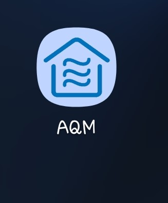
**Figure 1: App Icon**

### Home Screen: 
The initial screen that greets users when they launch the application is a crucial point of entry into the app's world. It sets the tone and prepares users for the experience that awaits them. Typically, this first screen serves as an introduction or a splash screen, captivating users with a visually pleasing and branded display.
As the application springs to life, the initial screen takes center stage, capturing attention and creating a sense of anticipation. 

It may feature captivating imagery, a captivating logo, or a brief tagline that reflects the app's purpose and personality. This screen is designed to leave a positive first impression on users, igniting their curiosity and motivating them to explore further.

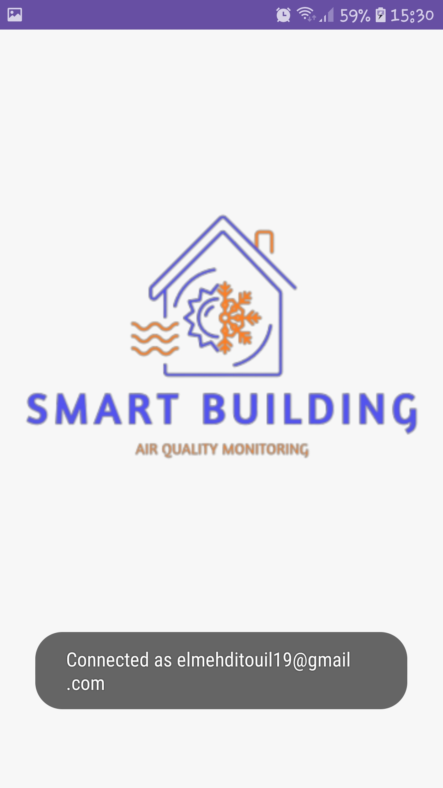
**Figure 2: Home Screen**

---

### Login Screen: 
The LOGIN screen is a crucial element of the application, ensuring that only authorized users can access its features. It provides a secure entry point where users can input their login credentials, such as username and password, to authenticate their identity. By requiring this step, the app establishes a protective barrier, safeguarding sensitive information and maintaining user privacy. 

The LOGIN screen interface typically includes intuitive input fields and clear instructions, guiding users through the authentication process. Additional security measures like two-factor authentication may be incorporated to enhance user data protection. Overall, the login screen acts as a secure gateway, allowing users to access their personalized accounts and ensuring a safe and tailored experience within the application.

**Figure 3: Login Screen**

---

### Sign Up Screen: 
The SIGN UP screen serves as a platform for new users to register an account within the application. It offers a streamlined process for users to provide necessary information such as username, address (optional), email address, and password. By filling out these details, users can create a personalized account and unlock the application's full range of functionalities. 

The SIGN UP screen ensures a smooth and intuitive experience, guiding users through the registration process with clear instructions and input fields. It acts as a crucial step in expanding the user base and allowing individuals to fully engage with the application's features and services. Overall, the sign-up screen facilitates the onboarding process, enabling new users to establish their presence and begin their journey within the application.

**Figure 4: Sign Up Screen**

---

### Dashboard Screen
The Dashboard screen presents all of the services that our app can do. We can also see the name of the current user and some other of his information.

Our application can detect the occupancy of a room as a machine learning module [see Chapter 6], also we see the list of the rooms located in a building.

Once the user finishes his session, he can sign out using the Sign out option in the menu at the top-end corner of the screen, which will allow him to return to the login activity. The user must sign in the next time he intends to use the app.

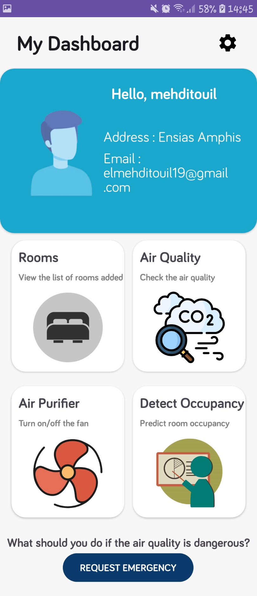
**Figure 5: Dashboard Screen**

---

### Room Lists Screen: 
The room lists screen provides users with a comprehensive overview of available rooms or locations that can be monitored for air quality. It gives information such as name, capacity, and size for each room, allowing users to identify the room they want to inspect or modify. Users can select a specific room from the list to access more detailed data or perform actions such as editing or removing the room by a long click on the designed room.

This screen aims to provide an organized and convenient way for users to manage their rooms, enabling them to monitor air quality efficiently and make necessary adjustments to maintain a healthy environment.

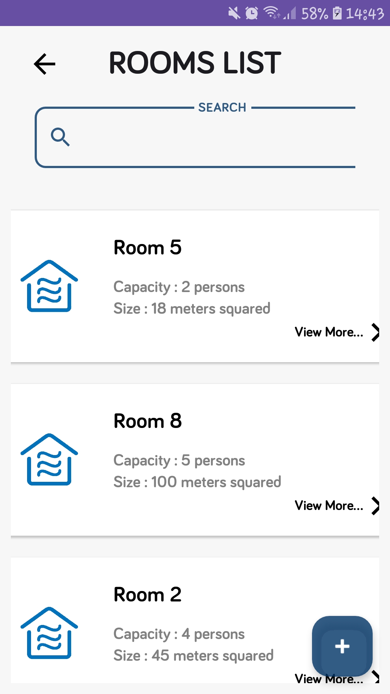
**Figure 6: Room Lists Screen**

---

### Detect Occupancy Screen: 
The Detect Occupancy screen displays the real-time status of room occupancy based on the machine learning module's predictions. Users can select a specific room from the list and view whether it is currently occupied or unoccupied.

The occupancy detection feature enhances user convenience by providing instant information about the room's status, eliminating the need for manual checks. It is especially useful for scenarios where users need to find available rooms quickly or track occupancy patterns over time.

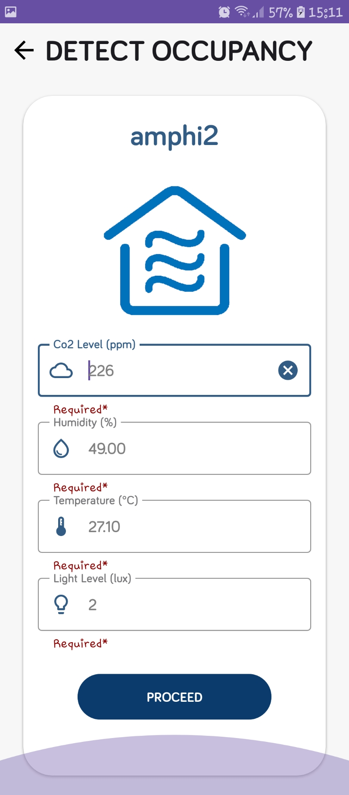
**Figure 7: Detect Occupancy Screen**

---

### Edit Room Screen: 
The Edit Room screen allows users to modify the details and settings of a specific room. Users can change the name, capacity, size, or any other relevant information associated with the room. This screen provides a user-friendly interface for updating room data, ensuring that users can customize and manage their rooms according to their needs.

By providing the ability to edit room settings, the application empowers users to maintain accurate and up-to-date information, facilitating effective monitoring and management of their spaces.

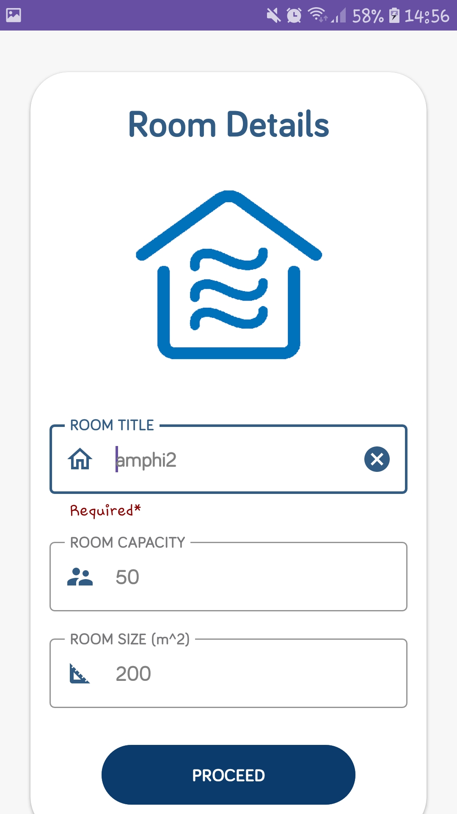
**Figure 8: Edit Room Screen**

---

### Fan Control Screen: 
The Fan Control screen offers users the ability to adjust the speed or settings of the ventilation or cooling system in a room. Users can select the desired fan speed or mode from the available options, providing a level of control over the room's air circulation.

This screen enhances user comfort and energy efficiency by allowing them to customize the fan settings based on their preferences and the current environmental conditions. Users can optimize air circulation and create a more pleasant atmosphere in the room through this intuitive control interface.

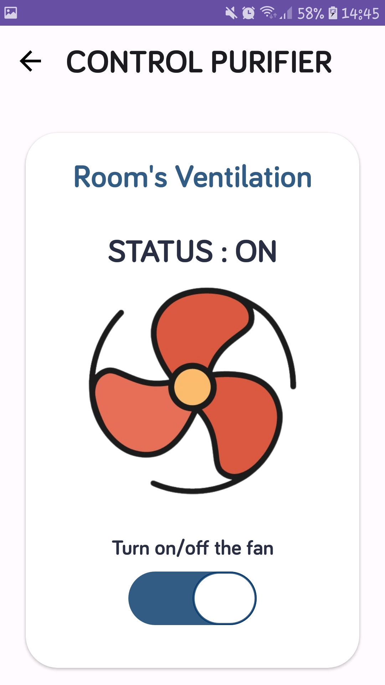
**Figure 9: Fan Control Screen**

---

### Overview Screen: 
The Overview screen provides users with a holistic view of the monitored rooms and their corresponding air quality metrics. It displays real-time data such as temperature, humidity, carbon dioxide levels, and particulate matter concentration for each room.

By presenting this comprehensive overview, the application enables users to quickly assess the air quality status of multiple rooms at a glance. This screen serves as a valuable tool for monitoring and identifying potential issues, allowing users to take timely actions to maintain a healthy and comfortable environment.

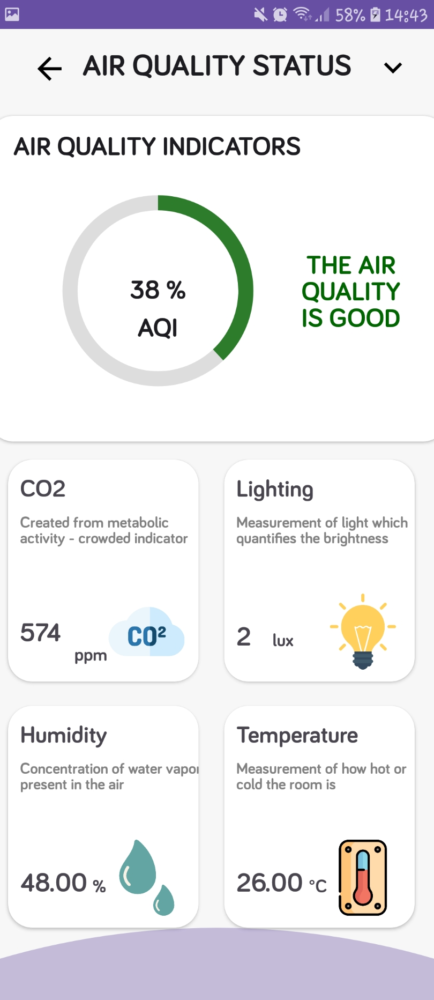
**Figure 10: Overview Screen**

---

### Room Options Screen: 
The Room Options screen offers users a range of customizable settings and actions for a specific room. It provides options such as adjusting ventilation settings, enabling or disabling occupancy detection, configuring notification preferences, and accessing historical data.

By offering these room-specific options, the application empowers users to fine-tune their air quality monitoring experience and tailor it to their specific needs. This screen serves as a control center for individual rooms, enabling users to optimize their air quality management based on room requirements and preferences.

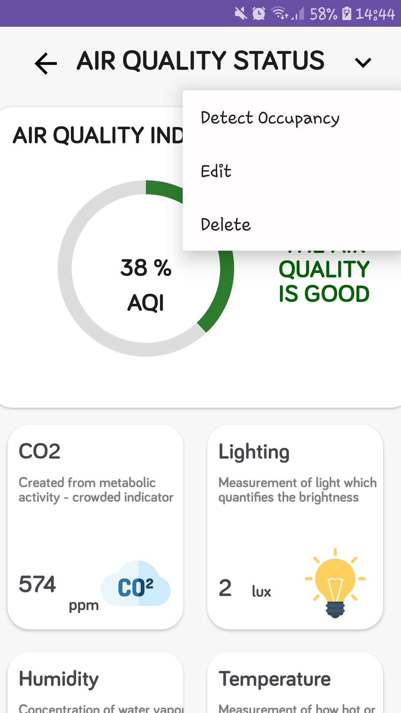
**Figure 11: Room Options Screen**

---

### Search Screen: 
The Search screen allows users to search for specific rooms or locations within the application. Users can enter keywords or filters to narrow down their search and find the desired room quickly.

This screen enhances user convenience and efficiency by providing a fast and effective way to locate specific rooms within a large number of available options. Users can save time and effort by utilizing the search functionality to pinpoint the exact room they need to access or modify.

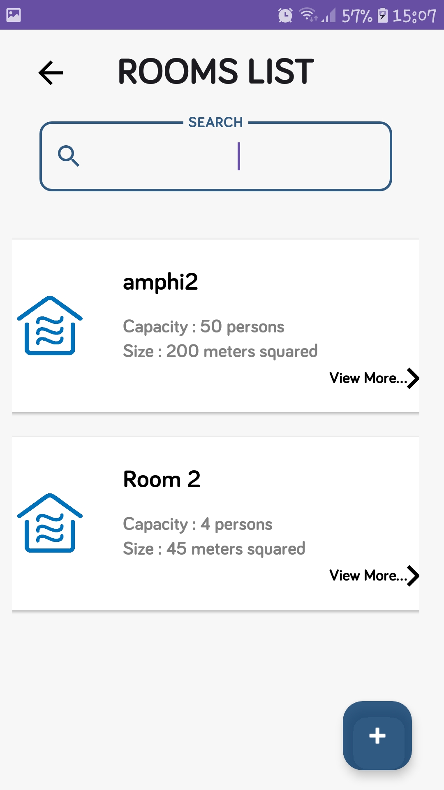
**Figure 12: Search Screen**

---

### Occupancy Result Screen: 
The Occupancy Result screen displays the outcome of the occupancy detection process for a specific room. It indicates whether the room is currently occupied or unoccupied based on the input from various sensors and the machine learning module's analysis.

This screen provides users with instant information about room occupancy, helping them make informed decisions regarding room usage, scheduling, or resource allocation. By presenting accurate occupancy results, the application optimizes room utilization and enhances overall efficiency.

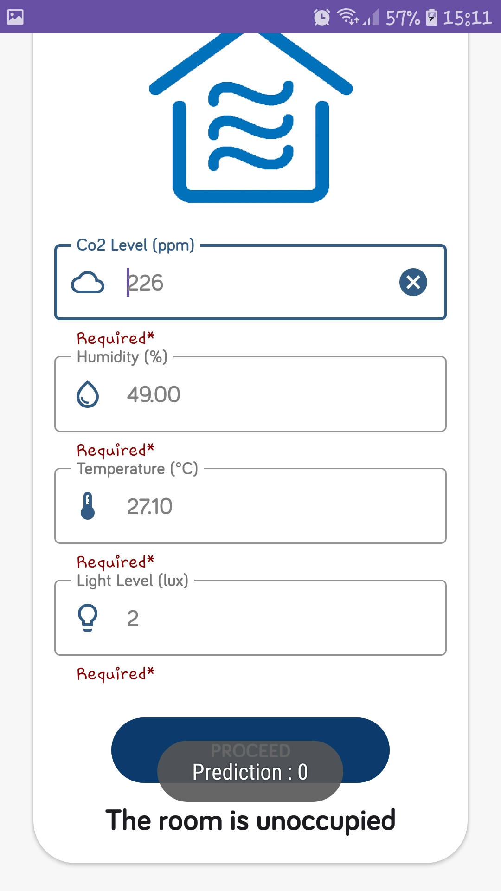
**Figure 13: Occupancy Result Screen**

---

### Sign Out Screen: 
The Sign Out screen appears when the user chooses to sign out of the application. It confirms the user's intention to end the current session and prompts them to confirm their action.

By including a sign-out confirmation screen, the application ensures that users have the opportunity to prevent accidental sign-outs and maintain control over their session. This screen serves as a final checkpoint, allowing users to confirm their decision or cancel the sign-out process if desired.

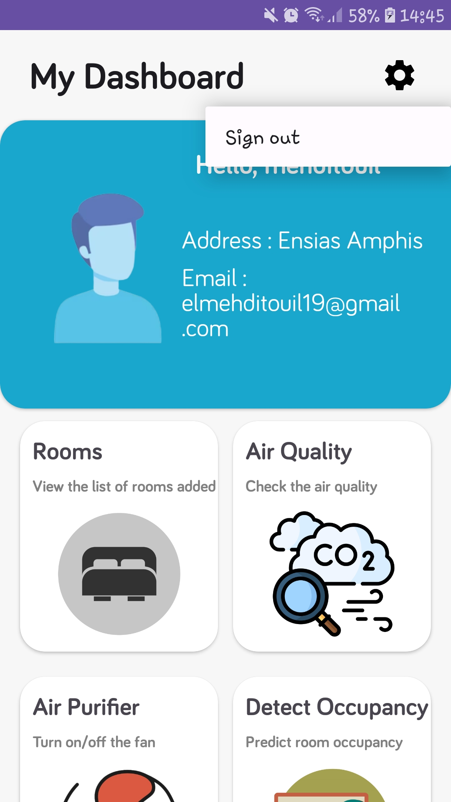
**Figure 14: Sign Out Screen**

---

These screenshots provide a glimpse into the visual interface and functionality of our application. By combining intuitive design, user-friendly controls, and informative displays, we aim to deliver a seamless and engaging user experience that meets the needs of our users.

We hope you find this overview helpful in understanding the different screens and their purpose within our app. If you have any further questions or need more information, please let us know.
